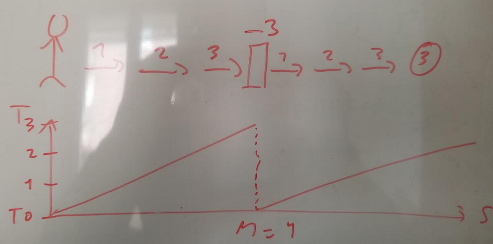
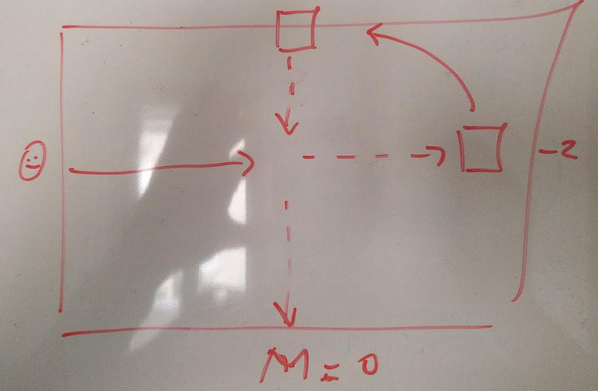
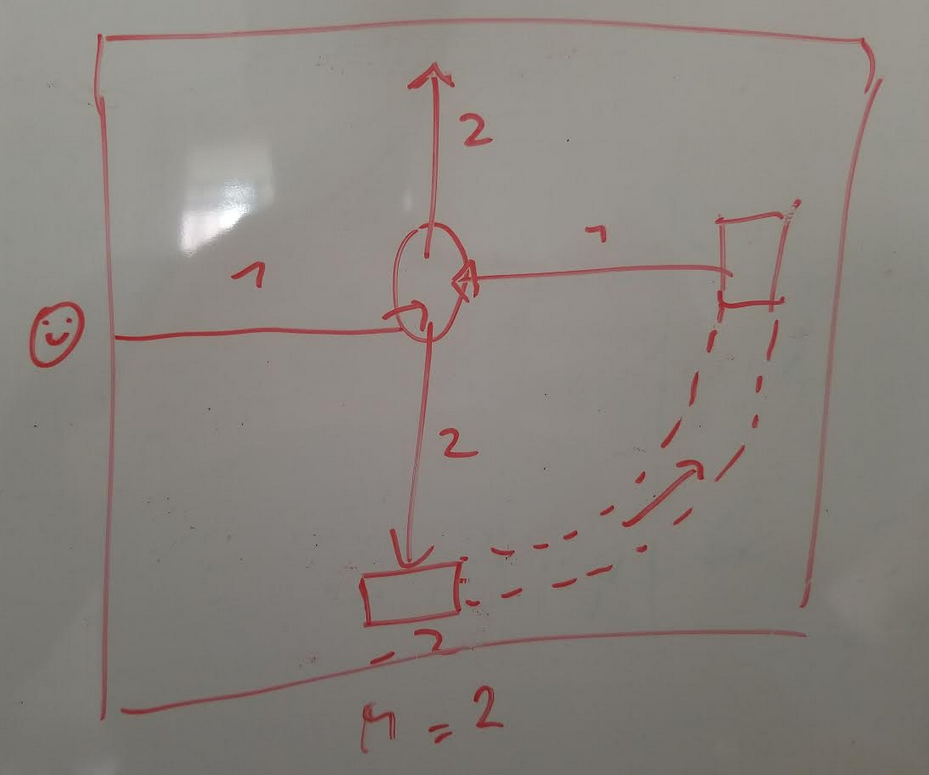
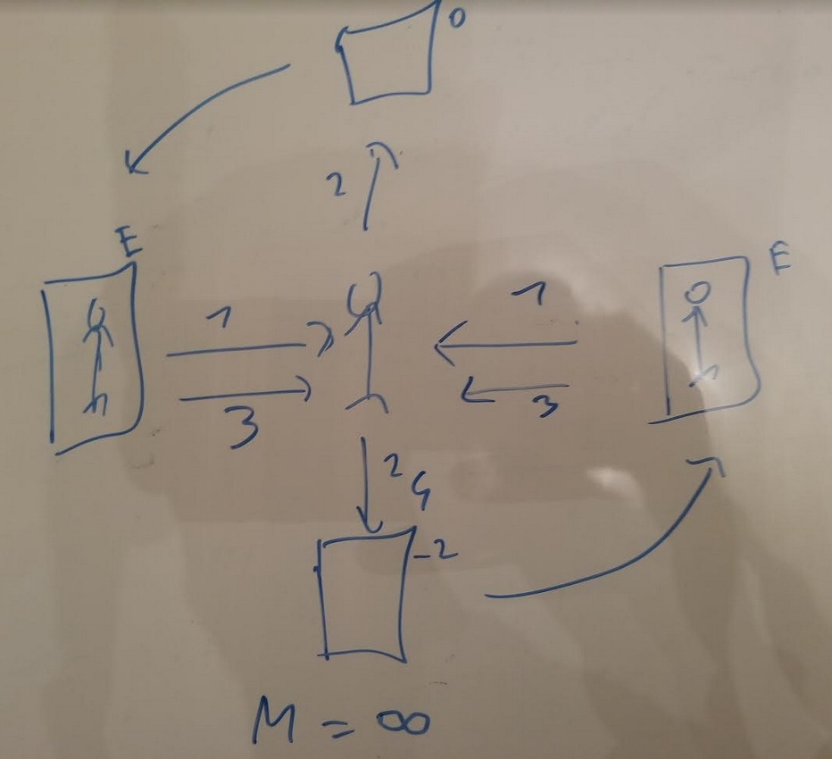
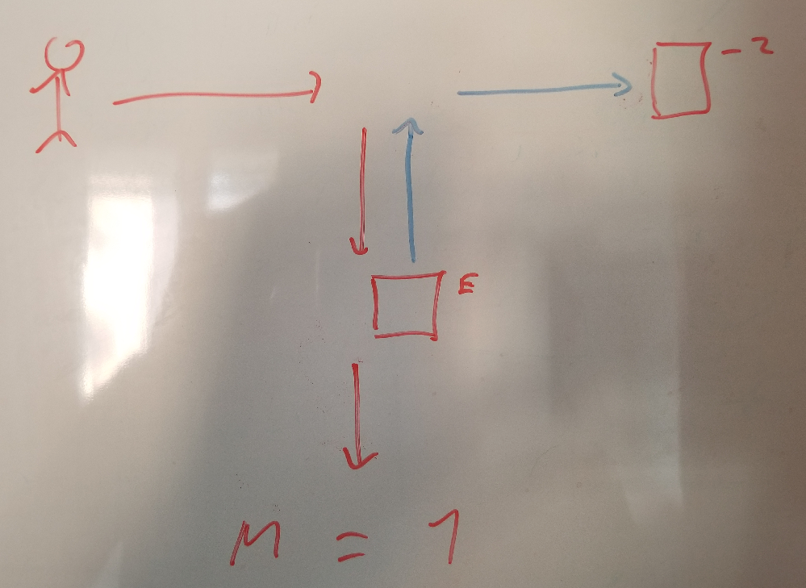

In this game, you will be like a movie writter, trying to write a movie that includes time travel.
The goal of the game is to **solve puzzle, using time travelling, and without creating paradoxes**.
In this game, you will **not** control characters in real-time.
Instead, you will prepare instructions for you characters, and they will execute them blindly.
In this sense, free-will is eliminated.
Your instructions will be "compiled" by the game engine, and if no paradoxes arises, it will execute.

First diagram shows a character. 
This guy goes only forward, one step at a time.
He needs to reach a treasure which is 6 steps away (the circle).
However, the treasure will vanish in only 3 steps of time.
The solution to this puzzle is simple: use a time portal!
Place this portal in the middle, and set it to `-3`.
Then run the simulation.
What will happen? Your character will take his first step, and magically, another himself will appear in the portal and take a step forward.
This is yourself from the future!
At step 3, your double will reach the treasure. Your initial self will enter the portal, thus closing the time loop.
Mission complete.
The diagram below shows the positions of the two clones horizontally, and the time vertically.

This was simple enough. But what about paradoxes?
To create a paradox, you need to interact with yourself, preventing yourself to enter the portal.
We add the following rule for collisions: when collisioning another version of yourself, you turn right.
You **always turn right** on a colision, regardless of the incoming angles.
In the following diagram, we split our time portal in two: one entrance portal, and one exit portal.
Place the portals are shown below: the entrance portal straight ahead, and the exit portal on top.
Set this portal to `-2`.
You will enter the portal at step 2, thus appearing at the beginning of the simulation.
You then travel down one step and hit yourself, thus deviating your initial self to the bottom, where there is no portal!
This is a paradox. There is NO trajectory possible in this instance. We say that the multiplicity `M` is zero.

But can we have two possible trajectories?
In the following diagram, the entrance portal is placed at the bottom.
The exit portal is on the right.
One classical solution is just to walk straight.
You will walk past the exit portal. Nothing will happen: an exit portal is just the place where you appear after time travelling, nothing more.
Then you continue just straight. No time travelling.
However, there is a second solution: At the start of the simulation, another instance of you will appear at the exit portal.
He will then proceed to walk to the center of the arena, colide with the initial version of you, thus deviating you to the time portal!
This solution is perfectly valid and coherent. 
In this version, you travelled to the past, and "conviced" yourself to go to the time portal, thus closing the loop.
The multiplicity `M` is two: two possible trajectories.

Can we have a multiplicity of more than two?
Let's just take the previous diagram, and add a new trick: a portal that teleports you back to the initial position when you go up.
No time travelling here: it's just teleportation. 
Nothing to see here! It could actually be done with regular "bumpers" that redirects you to the start. However that would complexify the diagram.
The first trajectory is just to go straight, like in the first diagram.
Second trajectory is also similar: you have one interaction with a past self.
You will go down and time travel, while your clone will go up. He will be transported to the start position, and then go straight.
That's trajectory number two.
However, there is a third trajectory possible at this point: instead of going straight, he could bump with another version of himself, and go down to the portal!
There is an infinity of trajectories: `M=∞`

Is there trajectory where your clone version, having time travelled, can head back to the time portal?
In the following diagram, you (or any object actually) exit from the time portal at the beginning of the simulation.
The object will hit you, be deviated to the right and enter the time portal. The loop is closed.
What you just hit is called a "Djinn": this object is coming from nowhere, it has no discernible origin, and exists without ever being created.
It is just caught in an infinite loop.
This is called the "bootstrap paradox".
The multiplicity seems to still be one, in this case.

