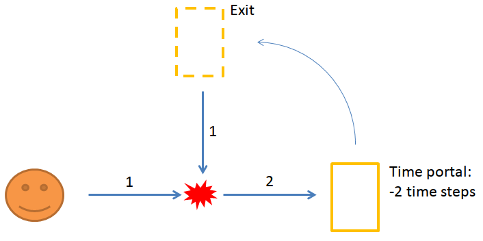
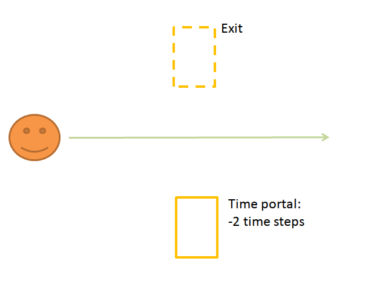
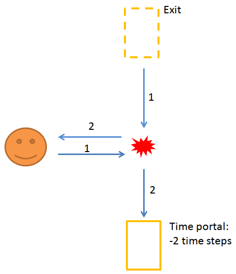
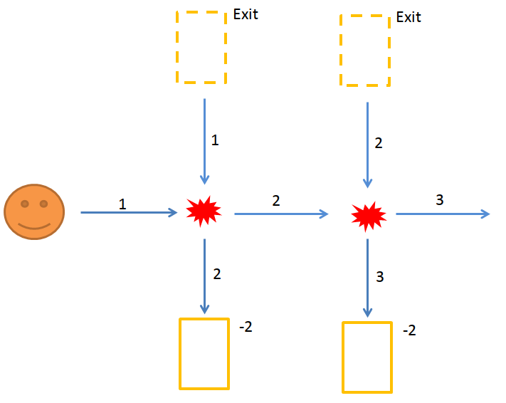
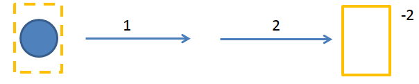

Time travellers can produce paradoxes, such as the grandfather paradox.
But that's not the only interresting thing that can happen to you while time travelling!
In this article we'll setup the simplest scenarios with time travel.
Grab your lunch box and let's start the trip.

Paradox
=======

Let's start with the well-know time traveller paradox.
Imagine that you are a billiard ball, rolling toward the right in a straight line.
If you encounter another ball, you will always turn right (as a rule).
You don't have any free will: you are just a billiard ball.
Time and space are discreet: you move step by step on a grid.

On the diagram below, there are two portals: one entrance portal straight ahead, and the corresponding exit portal at the top.
If you enter the first portal, you will exit the second portal... **two time steps before**.

So you start rolling.
You will enter the portal at step 2, thus reappearing at the beginning of the simulation.
You then travel down one step and hit yourself, thus deviating your initial self to the bottom, where there is no portal!
This is a paradox. There are NO trajectories possible in this instance. We say that the multiplicity `M` is zero.

```
M=0
```

Non-unique trajectories
=======================

This is where things get even stranger.
In the following scenario, there is a time portal at the bottom, that will teleport you to the exit portal, 2 steps back in the past.



The classical solution is just to roll straight and pass between the two portals.
To avoid any problem, it's always better to avoid time travelling.
However, there is another solution, shown in the diagram below.



At the start of the simulation, another ball appears in the exit portal: it's you from the future!
Both go straight one step, meeting in the middle. Then, as per the rule on collisions, both turn right.
The initial ball enters the portal at step 2, thus closing the loop. The second ball continues toward the left.

In this scenario, there are really **2 possible trajectories** for the ball. We say that the multiplicity `M` is two.

```
M=2
```

More trajectories
=================

Can we have a multiplicity of more than two?
Yes, we just need more time portals!



In the above diagram, there are three possible trajectories:

1. Go straight, no time travelling.
2. Go through the first pair of portals, with a collision in the center.
3. Go straight first, then go through the second pair of portals.

The next diagram shows a setup with an infinite number of trajectories.
We add three "bump" walls (in grey in the figure) that will bring you back to your initial position.


The first trajectory is just to go straight, like in the previous diagram.
Stepping over the exit portal does nothing.
The second trajectory is also similar: you have one interaction with a past self.
You will go down and time travel, while your clone will go up. He will bump on the walls, and get back to the start position.
He will then go straight to the right.
That's trajectory number two.

However, there is a third trajectory possible at this point: instead of going straight, he could bump with another version of himself, and go down to the portal!
There is an infinity of trajectories.

```
M=∞

```

The Djinn
=========

Is there trajectory where your clone version, having time travelled, can head back to the time portal?


In the diagram, your clone comes from the time portal at the beginning of the simulation.
He will hit you, be deviated to the right and enter again in the time portal. The loop is closed.
From the point of view of your clone, it is caught in an infinite loop.
He exits from the portal, hits a past self, and enters again in the portal. Infinitely. What a life.
What you just hit is called a "Djinn": an object trapped in a time travel loop. 



In the figure above, the blue object is trapped in a time loop. For instance, it could loop between T=10, T=11 and then go back to T=10.
It doesn't exit before that time, and doesn't exist after that time.
It is coming from nowhere, it has no discernible origin, and exists (briefly) without ever being created.
It could be anything: a teaspoon, an atomic bomb, Maria Carey.
This is called the "bootstrap paradox".


Conclusion
==========

In our classical, non-time-travelling universe, there is only one trajectory for anyone.
In Newton physics, the future is entierely determined by the past.
Using the initial state of a system together with the equations of movement allows to compute the next step.
This concept is heavily used in any computer simulations and games, for instance.

In the presence of time travel, this determinism is not true anymore: there is now a feedback loop in the system.
You cannot compute the next step using just the previous state. 
Trajectories are not unique anymore.

This is strange, but you need to look at it that way: in mathematics, a set of equations can sometimes admit two solutions.
For instance, second degree equations can have up to two answers.
Here, trajectories are your solutions. The system can admit several solutions in the presence of time travel.
This is because time travel introduces a feedback loop in your system: the system is not linear anymore.
So, yeah, a billiard ball can admit zero, one, or more trajectories depending on the placement of the portals.

