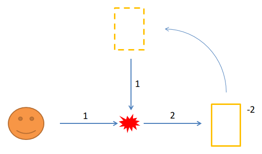

Time travelling can produce paradoxes, i.e. impossible situations.
But that's not the only interresting phenomena!

Non-unique trajectories
=======================

Let's setup a small game.
Imagine that you are a billiard ball, rolling toward the right in a straight line.
If you encounter another ball, you will always turn right (as a rule).
There is also a time portal at the bottom, that will teleport you to the exit portal, 2 steps back in the past.


The classical solution is just to go straight and passing between the two portals. No problem.

However, there is another solution: at the start of the simulation, another ball appears in the exit portal: it's you from the future!
Both goes straight one step, meeting in the middle. Then, as per the rule on collisions, both turn right.
The initial ball enters the portal at step 2, thus closing the loop. The second ball continues toward the left.

In this scenario, there are really **2 possible trajectories** for the ball. We say that the multiplicity `M` is two.

```
M=2
```

No trajectories
===============

But what about paradoxes?
To create a paradox, you need to interact with yourself, preventing yourself to enter the portal.



Place the portals as shown: the entrance portal straight ahead, and the exit portal on top.
Set this portal to `-2`.
You will enter the portal at step 2, thus appearing at the beginning of the simulation.
You then travel down one step and hit yourself, thus deviating your initial self to the bottom, where there is no portal!
This is a paradox. There is NO trajectory possible in this instance. We say that the multiplicity `M` is zero.

```
M=0
```

More trajectories
=================

Can we have a multiplicity of more than two?
Let's just take the previous diagram, and add a new trick: a portal that teleports you back to the initial position when you go up.
No time travelling here: it's just teleportation. 


The first trajectory is just to go straight, like in the first diagram.
Second trajectory is also similar: you have one interaction with a past self.
You will go down and time travel, while your clone will go up. He will be transported to the start position, and then go straight.
That's trajectory number two.

However, there is a third trajectory possible at this point: instead of going straight, he could bump with another version of himself, and go down to the portal!
There is an infinity of trajectories.

```
M=∞

```

The Djinn
=========

Is there trajectory where your clone version, having time travelled, can head back to the time portal?


In the diagram, your clone (in blue in the picture) comes from the time portal at the beginning of the simulation.
He will hit you, be deviated to the right and enter again in the time portal. The loop is closed.
From the point of view of your clone, it is caught in an infinite loop.

What you just hit is called a "Djinn": this object is coming from nowhere, it has no discernible origin, and exists without ever being created.
This is called the "bootstrap paradox".
The multiplicity seems to still be one, in this case.


Conclusion
==========

In our classical, non-time-travelling universe, there is only one trajectory for anyone.
In Newton physics, the future is entierely determined by the past.
Using the initial state of a system togheter with the equations of movement allows to compute the next step.
This is heavily used in any computer simulations and games, for instance.

In the presence of time travel, this determinism is not true anymore: there is now a feedback loop in the system.
You cannot compute the next step using just the previous state. 
Trajectories are not unique anymore.

This is strange, but you need to look at it that way: in mathematics, a set of equations can sometimes admit two solutions.
For instance, second degree equations can have up to two answers.
Here, trajectories are your solutions. The system can admit several solutions when time travel is here.
This is because time travel introduces a feedback loop in your system: the system is not linear anymore.
So, yeah, a billiard ball can admit zero, one, or more trajectories depending on the placement of the portals.

