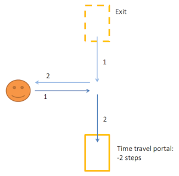

In this game, you will be like a movie writter, trying to write a movie that includes time travel.
The goal of the game is to **solve puzzle, using time travelling, and without creating paradoxes**.
In this game, you will **not** control characters in real-time.
Instead, you will prepare instructions for you characters, and they will execute them blindly.
In this sense, free-will is eliminated.
Your instructions will be "compiled" by the game engine, and if no paradoxes arises, it will execute.

Concept
=======

First diagram shows a character. 
This guy goes only forward, one step at a time.
He needs to reach a treasure which is 6 steps away (the circle).
However, the treasure will vanish in only 3 steps of time.

The solution to this puzzle is simple: use a time portal!
Place this portal in the middle, and set it to `-3`.
Then run the simulation.
What will happen? Your character will take his first step, and magically, another himself will appear in the portal and take a step forward.
This is yourself from the future!
At step 3, your double will reach the treasure. Your initial self will enter the portal, thus closing the time loop.
Mission complete.
The diagram also shows a plot of the positions of the two clones horizontally, and the time vertically.

Using the time portals, you can create situation with multiple trajectories.
The goal of the game is to collect the treasure on all possible trajectories.
WIP...

