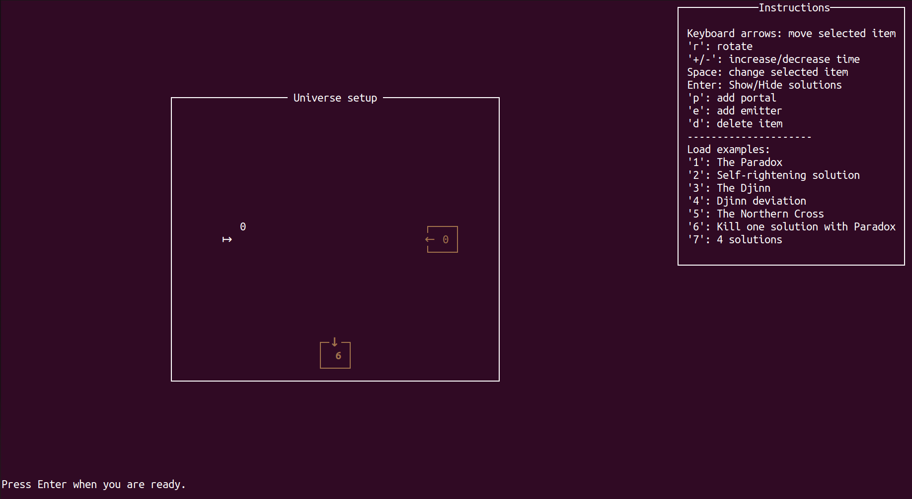
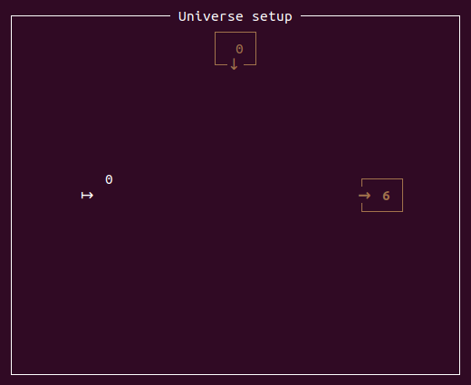
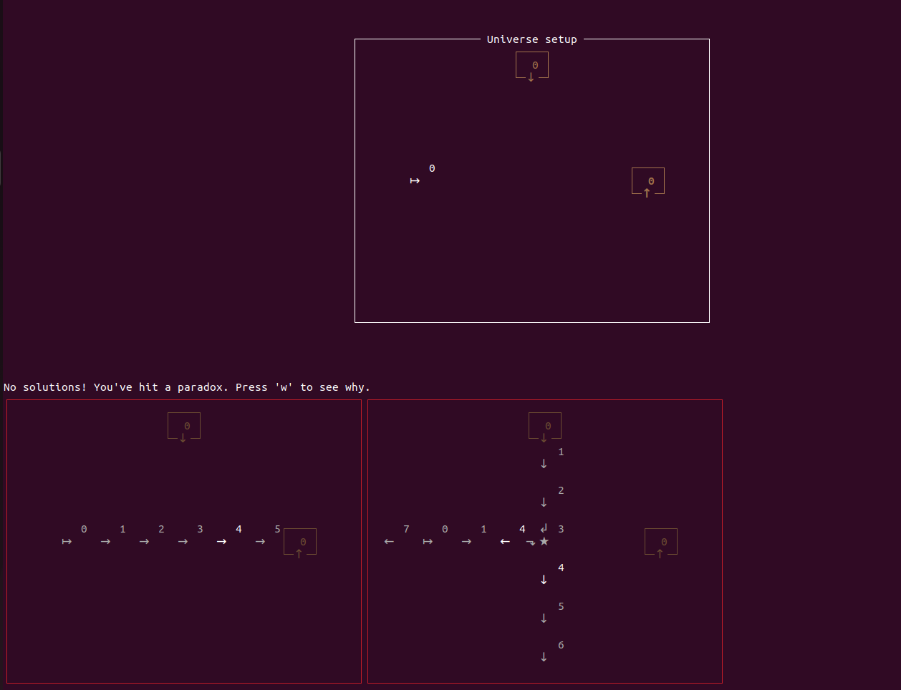
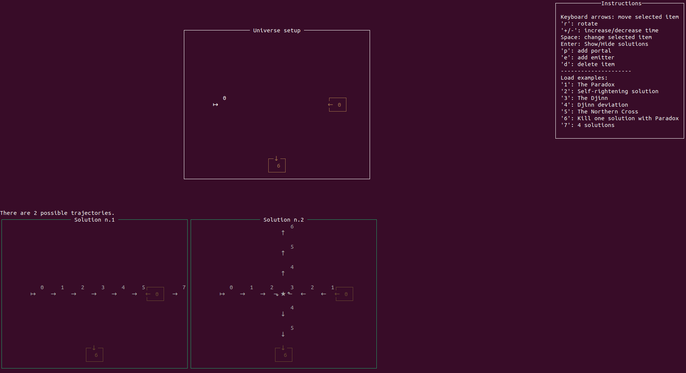
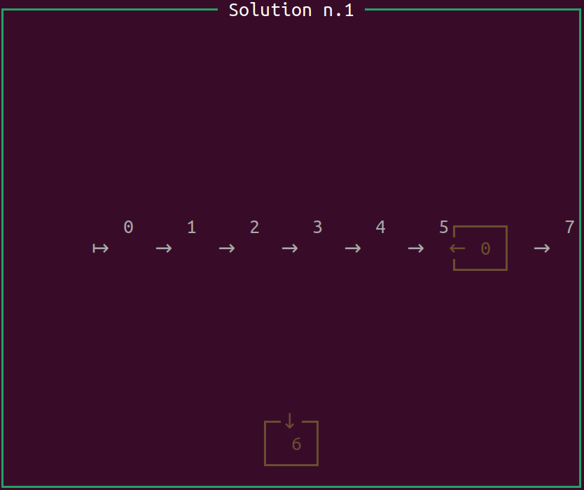
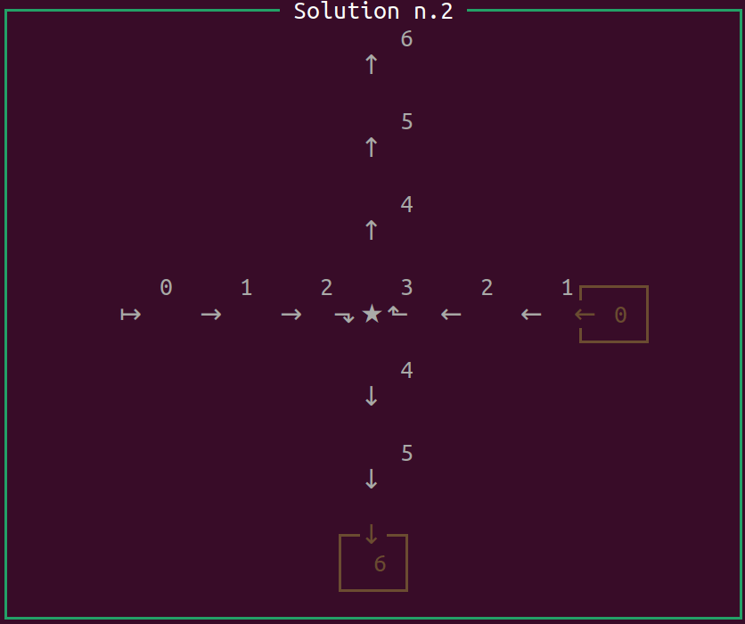

Following my previous post, I went ahead and created a small demo on the concept of time travelling.

[It is available here.](https://github.com/cdupont/Timeloop)

The install instructions are included in the Readme file.

How to play
===========

You start by setting up the universe, and then run the simulation.
In the picture bellow, there is an "emitter" arrow on the left and two time portals: an entry portal, and an exit portal.    
The emitter will emit a "walker", here at time step 0.
The walkers always walk straight, except when they collides with another walker. 
When a walker collide with another walker, they always turn right (as a rule).
If the walker enters the entry portal at the right time, it will walk out of the exit portal at the mentioned time.
   
{ width=1000px }

You can move the various elements of the universe (emitters and portals), setup their activation time, and add more of them (see the instructions).   
**When you are ready, hit Enter.**

Paradox
=======

Let's start with the usual paradox.

This universe has no solutions.
By hitting 'w', you can see why. 

Two red universes appear: both of them are disfunctional because the portal cannot be logically fulfilled.
If the first universe, a walker enters the portal but does not exit. In the second universe, a walker exits the portal but no walker enters.
Both universe are "wrong" and are written off.

2 Solutions
===========

In this universe setup, there are **2 possible trajectories** for the walker:   
The first solution is simple: he just goes straight. At step 6, he will walk over the exit portal (this has no effects).

However, there is another solution!   
At the start of the simulation (highlighted as step 0), another walker appears in the exit portal: it's you from the future! Both goes straight some steps, meeting in the middle. Then, as per the rule on collisions, both turn right. The initial walker enters the portal at step 6, thus closing the loop. The second walker continues toward the top.

You can play around with different universe setups, and generate interresting configurations such as paradoxes, "Djinns" and more.
You can load examples using the number keys.   
Have fun!

