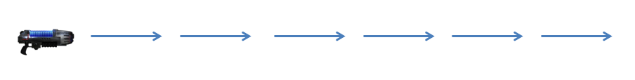
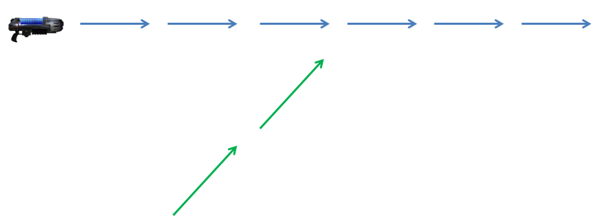
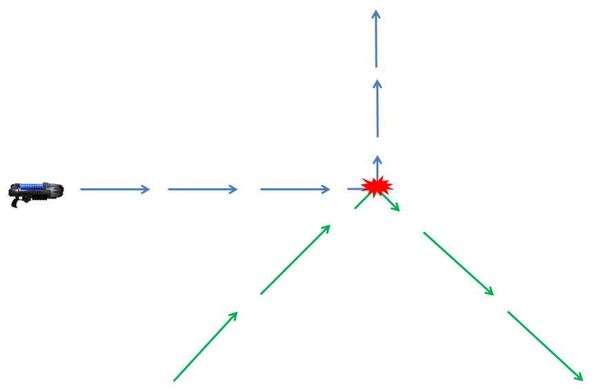
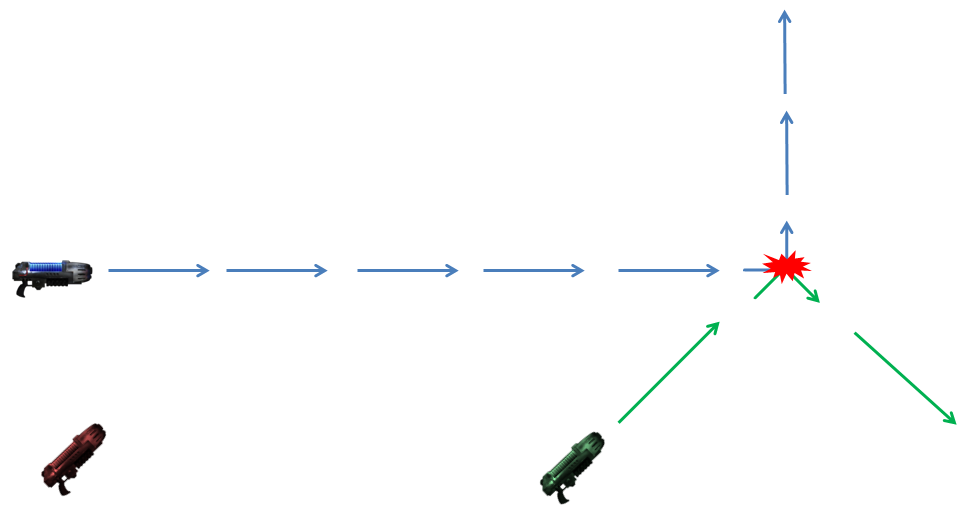
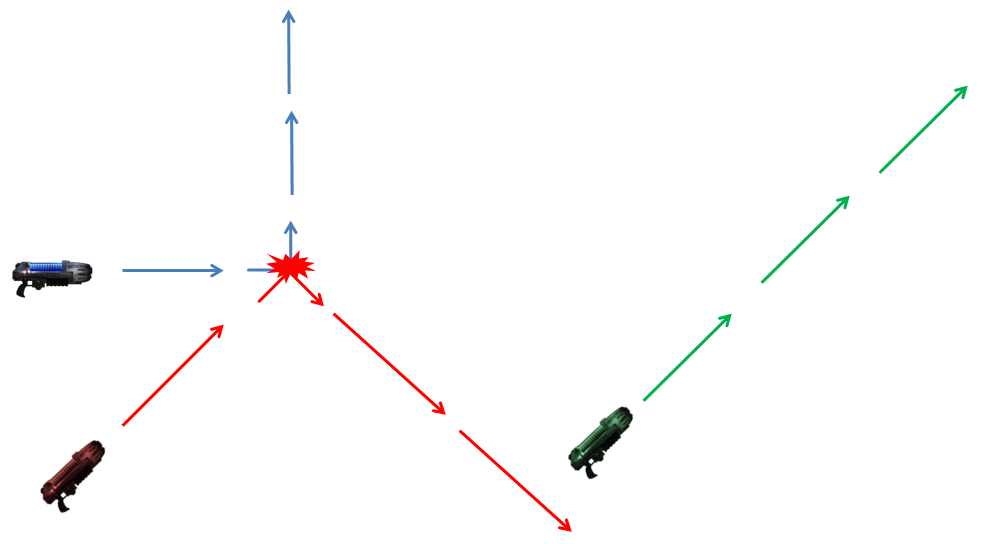
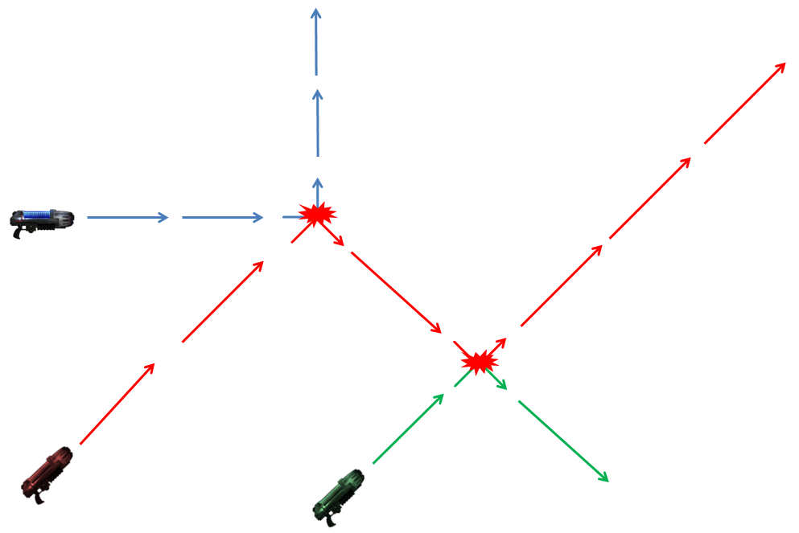

In fact, paradoxes can exist without time travel.
Let's say I have a plasma gun:

Another ray may come from afar:

As everybody knows, plasma rays are deviated when they collide. In fact, they are always deviated 90°, away from the other ray:

Space is discreet (like a chess board). Each tile may contain either a plasma gun, a plasma ray or nothing. Rays can go either straight or diagonally.
An important precision: rays are "instant", they do not take any time to propagate.

Paradoxes
=========

With this setting, paradoxes can appear:

As it comes back on itself, the ray will collide with itself and thus prevent itself to pass through the mirrors.

2 solutions
===========

Like with the time travelling examples, we can also have situations that admits several solutions.
For example with this particular setting:

Another solution exists:

There are two solutions: the plasma ray can go either straight or through the mirrors.

The key here is that the plasma rays should be "instant" and "eternal". At the moment you fire the gun, it's like the ray was always there and always will be there.
Another way to see it, is to consider that when you fire the gun, the gun will time travel to any point in time (past and future), and make fire.
If time was plotted vertically on the graphs, the rays would be like vertical walls.

If rays took "time" to propagate, the "paradox" setup would not be paradoxical: it would just be an oscillator. The ray would first hit the mirrors, go back to itself, self-collide and interrupt the part of the ray going through mirrors. This would in turn prevent the collision a bit later and the cycle continue.
If the rays took time=1 to cover one tile, this oscillator would have a period of 7 (the time it takes to go through the mirrors back to collision). However, with "instant" rays, this setup is really paradoxical.  

PS. Another consideration is that collisions can have cascading consequences.
For example in this situation:

If I fire the red plasma gun, This is what I should get:

The green trajectory was affected by the new collision between red and blue. More collisions can also appear:

