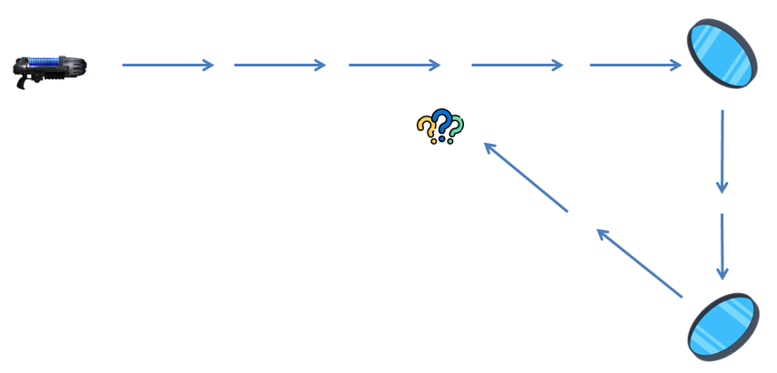
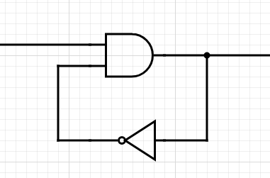
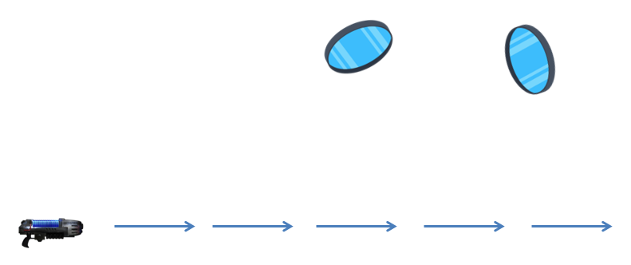
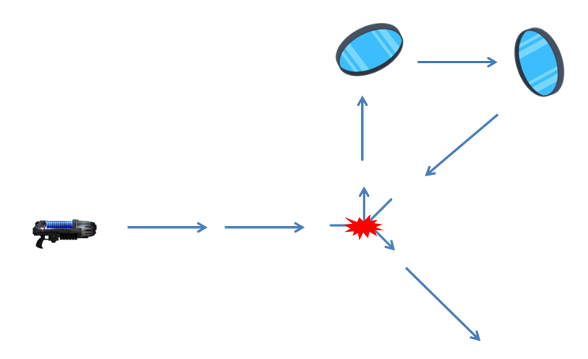
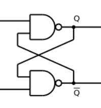
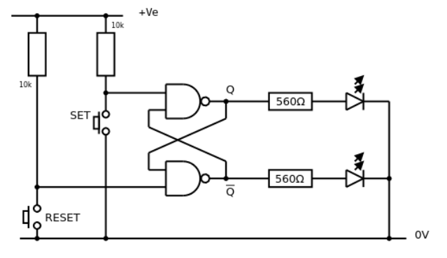
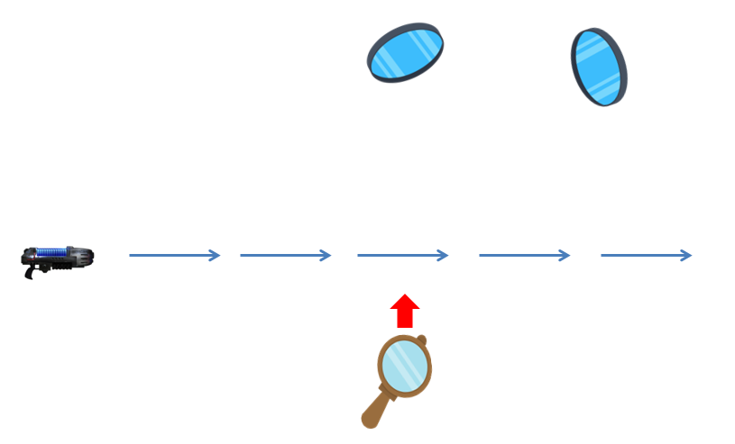

In the previous post, we saw that paradoxes can appear in some special settings.
Similar settings can be created with electronics!

The paradox
===========

The following diagram shows the paradox with plasma rays:

This is equivalent to the "oscillator" electronic circuit.

In this circuit, the feedback loop "negates" the previous input.

If both inputs of the AND gate are 1, then the output will be 1.
This will bring a 0 back to the AND gate because of the NOT gate.
This will then set 0 to the output, and the cycle continues.

As electrical signal takes time to propagate, we have built an oscillator.

2 Solutions
===========

As we saw, the following configuration admits 2 solutions.

this is the second solution:

What will be the equivalent in electronics?
Here is the circuit:

This is called a bistable. It really admits two solutions.
The full circuit is:

If I press briefly the SET button, the Q output will be set to 1 in a stable manner.
Conversely, if I press briefly the RESET button, the Q output will be set to 0 in a stable manner.

Here is the full explaination.

Solution 1: Consider SET = 1, RESET = 1, Q = 0 and therefore Q = 1. Making SET = 0 forces Q = 1. Both inputs to the left hand NAND gate are now HIGH and so Q = 0. The feedback ensures that at least one of the inputs of the right hand NAND gate is now LOW and so Q = 1. Therefore, making SET = 0 forces Q = 1 as required.

Solution 2: Consider SET = 1, RESET = 1, Q = 1 and therefore Q = 0. Making RESET = 0 forces Q = 1. Both inputs to the right hand NAND gate are now HIGH and so Q = 0. The feedback ensures that at least one of the inputs of the right hand NAND gate is now LOW and so Q = 1. Therefore, making RESET = 0 forces Q = 0 as required.

Regarding our plasma rays, we can easily switch solutions using a portable mirror:

With the portable mirror, we can deviate temporarily the plasma ray to make it go through the mirrors set.
Once this is done, the second solution is stable. We can remove the portable mirror.

