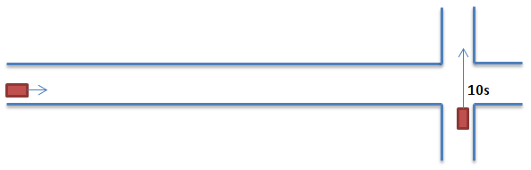
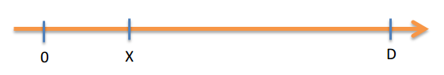

Here is a little enigma:
You are driving your car, approaching an intersection.
A person is waiting at that intersection, waiting for you to pass.
At what speed should you be driving in order to never let him pass?
Let's set up the scenery:



The other car needs 10 seconds to cross the intersection.
That driver will then have to estimate, using your approximate speed, how much time it will take you to reach the intersection.
If it's more than 10 seconds, he can pass.
If it's less than 10 seconds, he'll wait and then pass.
How can you block him indefinitely?    

Here is the answer to this pretty diabolic anigma.
The idea is to adopt at every moment a speed that puts you 10 seconds away from the intersection!
Of course, the speed you should take is not constant.
if you're 100m away from the intersection, then you should go at a speed of 100m/10s = 10m/s.
if you're 50m away from the intersection, you should go at 50m/10s = 5m/s.
So you're speed is continuously decreasing, but not linearly of course.
Let's try to find what is your speed as a function of time.



On this axis, your car starts at 0. The intersection is at $D$.
Your position at moment $t$ is $x(t)$, and your speed is $x'(t)$.
The other driver needs a time of $T$ to cross the intersection.
Starting at 0 at time 0, with speed D/T:    

(@1) $t=0 \Rightarrow x(0)=0, x'(t)=\frac{D}{T}$   

Never reaching D, but tangeanting it:    

(@2) $t=\infty \Rightarrow x(\infty)=D, x'(\infty)=0$    

We want our speed to be so that it gives the impression that we'll arrive in $T$ seconds, over the distance left to go (if that speed was constant).

(@3) $x'(t) = \frac{D - x(t)}{T}$    

This equation is otherwise written:

(@4) $D = x(t) + Tx'(t)$

That last equation expresses the fact that the distance $D$ can be split in two parts: if we are at time $t$, then that means we already done a distance of $x(t)$. The remaining distance is our current speed multiplied by $T$.
What can be the function behind our speed? 
Well, an equation linking a function and its derivate is often solved with an exponential. It should be an exponantial of the form $e^{-at}$ because our speed decreases but never reaches zero.
So let's give it a try:

$x(t) = \alpha e^{-at} + \beta$   
$x'(t) = -a \alpha e^{-at}$  

Combining with (@1) and (@2) we can calculate:

$\alpha + \beta = 0$   
$\beta = D$    
$\alpha = -D$    
$a = \frac{1}{T}$    

Finally:    
$x(t) = -De^{-\frac{t}{T}}+D$    
$x'(t) = \frac{D}{T}e^{-\frac{t}{T}}$     

Here is the plot of those two functions, if we consider $T=10s$ and $D=150m$:

```{r plots, echo=FALSE}
require(stats)
D = 150
T = 10
t = seq(0, 80, 0.01)
x = -D*exp(-(t/T))+D
v = (D/T)*exp(-(t/T))
plot(t, x, type="l", main="Evolution of position through time", xlab="time (s)", ylab="position (m)", xlim=c(0,80), ylim=c(0, D+10),  xaxs = "i", yaxs = "i")
abline(h=D, col="red")
text(2, D-3, "D", 1, col="red")

plot(t, v, type="l", main="Evolution of speed through time", xlab="time (s)", ylab="speed (m/s)", xlim=c(0,80), ylim=c(0,(D+10)/T), xaxs = "i", yaxs = "i")
text(5, D/T, "D/T", 1, col="red")
abline(h=1, col="red")

```

Looking at the second graph, we can see that our speed will become negligible ($v<1m/s$) after 25-30 seconds.
This is nearly 3 time the initial waiting time of 10s.
Finally, once you arrive at the intersection, you can stop completely and block the other driver.
How evil!!!

