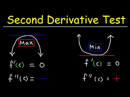

Wow, a math post, it's been a long time! 
[Last one](/blog/posts/Math/2014-12-08-Car.html) was 9 years ago.

Intro
=====

Here an intro, tiktok style (click for video):

I want to strap down a big heavy cylinder on a flatbed truck.

[![enter image description here][1]][1]

The strap is attached to the truck bed as shown in the picture and also behind.

**Will the strap slip off as in the next picture?**

[![enter image description here][2]][2]

For very flat cylinders (close to a circle), the rope cannot slip: the rope is following a diameter of the circle and it's obviously the shorter path from one side to the other.
Try with a plate! 

However, for higher cylinders (like the glass in my video), it tends to slip.

Model
====

We can model the position of the string as in figure below (where I omitted for clarity the lateral surface of the cylinder): its initial position is along path $ABCD$, but we can study what happens if it follows a slightly displaced path $AEFD$, where $AE$ and $DF$ are geodesic on the cylinder, i.e. straight lines on its unfolding.

[![enter image description here][3]][3]

If we set $h=AB=CD$, $r=BO=OC$ and $\alpha=\angle BOE$, then the length $l$ of $AEFD$ is:
$$
l(\alpha)=2\sqrt{h^2+r^2\alpha^2}+2r\cos\alpha.
$$
(Note that $BE=r\alpha$ and that $ABE$ is a right triangle on the unfolded cylinder).

Visual resolution
=================

Say that you are pulling the top strap sideways so that it stays parallel to its initial position.
As you pull, the top part of the cylinder will "produce" slack because a chord of the circle is always shorter than the diameter. In the same time, the side will "consume" slack because the strap is now oblique instead of vertical. Which one wins?

Using the notation above with $r = 1$ and $h = 1$, the top section will produce slack similar to a cosine (horizontal axis is the angle $\alpha$, vertical is the amount of "slack" given):
$$
1-\cos\alpha
$$
[![enter image description here][4]][4]

The side will consume slack proportional to (horizontal axis is the angle $\alpha$, vertical is the amount of "slack" consummed):
$$
\sqrt {1 + \alpha^2 }-1
$$

[![enter image description here][5]][5]

Those two functions looks very similar. Here they are on the same graph.

[![enter image description here][6]][6]

Zooming in, the blue curve is always above the green curve (on the range $0<\alpha<\pi/2)$, so theoretically for $h=r$ it will slip.

Here is [a 3D plot][7] with $\alpha$ on the x axis and h on the y axis ($r=1$). Vertically is the amount of slack in total (top - side).

[![enter image description here][8]][8]

From this plot we can see that for $h<1$, the surface dips below 0 (blue/purple part). More slack is taken than given: it holds tight.
For $h>1$, the surface is above 0 (green part): it slips.

Numerical resolution
====================

Let's call $s$ the slack.

$$
s(\alpha) = 1 -\cos\alpha - \sqrt {h^2 + \alpha^2 } + h 
$$

We have no slack at the start: $s(0)=0$. Around this point, we need to calculate the derivate of $s(\alpha)$ to know if the slack will increase or decrease.

$$
s'(\alpha) = \sin\alpha - \frac{\alpha} {\sqrt {h^2 + \alpha^2} }  
$$

We have $s'(0)=0$ (if $h>0$), which means that the slack varies very little around $\alpha=0$. There is as much slack consumed than slack produced.

To see if $\alpha=0$ is a point of minimum or maximum, we can compute the second derivative:
$$
s''(\alpha) = \cos\left(x\right)-\dfrac{y^2}{\left(x^2+y^2\right)^\frac{3}{2}}
$$

$$
s''(0)= 1 - \dfrac{1}{h}
$$

Remember:

For $h<1$, the second derivative is negative. This means that the slack is at its a minimum!
The slack will slowly increase. It slips.

For $h>1$, the second derivative is positive. This means that the slack is at its a maximum already and will become "negative" is you pull the string. It holds tight.

Looking closer
==============

Some part of the surface above looks funny. Here it is with $h=0.9$ (slightly shorted than the radius):

[![enter image description here][9]][9]

The curve dips below 0 before getting back up. This shape is normally safe ($h<1$), however if the strap is even slightly elastic or you misplace it, it can reach a point were it will completely slip off.

Shapes below $h=0.74$ are completely safe:

[![enter image description here][10]][10]

The curve never gets above 0 before $\pi/2$. You can strap them as you want (even close to the border): they will not slip.

  [4]: https://i.stack.imgur.com/fbtKZ.png
  [5]: https://i.stack.imgur.com/xbWFc.png
  [6]: https://i.stack.imgur.com/xwvMG.png
  [7]: https://www.math3d.org/zRjxc3mGB
  [8]: https://i.stack.imgur.com/Ee5zm.png
  [9]: https://i.stack.imgur.com/PTqGJ.png
  [10]: https://i.stack.imgur.com/wokyh.png

  [1]: https://i.stack.imgur.com/zcIwN.png
  [2]: https://i.stack.imgur.com/eOw9o.png 
  [3]: https://i.stack.imgur.com/nkZ0A.png

