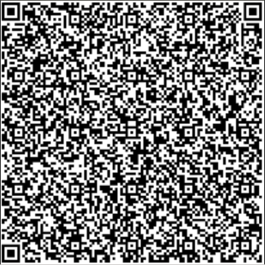

I recently got my Green Pass (also named EU Digital COVID Certificate, or Pass Sanitaire). So I got curious: What's inside? How does it works?
A quick search on Internet gives various sites that can decode the data.
Say, this is my Green Pass:



For example, [this website](https://greenpass-decoder.debbaweb.it/qrdata) gives the result:

```
Vaccination Group
 Dose Number:1
 Marketing Authorization Holder:ORG-100030215
 vaccine or prophylaxis:1119349007
 ISO8601 complete date: Date of Vaccination:2021-02-18
 Country of Vaccination:AT
 Unique Certificate Identifier: UVCI:URN:UVCI:01:AT:10807843F94AEE0EE5093FBC254BD813#B
 vaccine medicinal product:EU/1/20/1528
 Certificate Issuer:Ministry of Health, Austria
 Total Series of Doses:2
 disease or agent targeted:840539006
Surname(s), forename(s)
 Standardised surname:MUSTERFRAU
 Surname:Musterfrau-Gößinger
 Standardised forename:GABRIELE
 Forename:Gabriele
Schema version:1.2.1
Date of birth:1998-02-26
```

From a privacy standpoint, that seems OK. 
There is only your name, surname, date of birth.
The other informations are related to the vaccine you took.

As a Linux guy I was curious to see if I can decode it myself using only command line tools.
There are already some programs to decode your Green Pass, in [python](https://github.com/giuseppeM99/GreenPassVerifyBot), [javascript](https://gist.github.com/lmillucci/48804b0598553689fc5054da10e63231) or [php](https://github.com/masterix21/green-pass).
But why do things the easy way if there is a hard way to do them??
Linux cli has plenty of tools to do this kind of things. Let's see...

If you are in a hurry, you can skip directly to the [Summary](#summary) section.

Preliminary
===========

Before we begin, we need to install some tools.
The EU Green Pass is based on QR code, CBOR and base45, so we need to install the corresponding tools.
```
# QR code reader
$ sudo apt-get install zbar-tools

# base45 decoder. You need Python3.7 installed (https://www.python.org/downloads/)
$ sudo pip install base45

# CBOR analyser. You need Rust installed (https://www.rust-lang.org/tools/install).
$ sudo cargo install cbor-diag-cli
```

With this heterogeneous toolbox installed, let's go!

Decode the GreenPass
====================

To decode the Green Pass, the first thing is to read the QR code.
You need to download your green pass as an image named `QR.png`.
Let's try it:
```
$ zbarimg -q --raw QR.png
HC1:6BFOXN%TS3DHPVO13J /G-/2YRVA.Q/R86MJ2FC1J9M$DI9C9I99/MORPS$S:LC/GPWBILC9GGBYPLDXI25P-+R2YBV44PZB6H0CJ0TM8%K1. KOKGTM8$M8SNCXL9LM0C KPLI8J4RK46YBDQEJO82%K:XFE70*LP$V25$0Q:J$$0U*5W$51+5F2LD-4-$4+1HX2JU*5B/CU/HS-DO.C63P1*2PSPIE9WT0K3M9UVZSVV*001H698OH6RWPOP6OH6MN96VHDV22JA.IEGW2TK2TH9YJA-LH 43TK96L6SR9MU93FGRRJ/9TL4T1C9 UP%C9M61$KU9J1MK99TGCPI2YU0J5Z/JDRGY0W/V70ZD$T732W9R3%$D+W3IS7:*D8KGY2WT0WNSG3UQAH5M8CGUEDDKGUE2GOGUESAC4PIQJAZGA2:UG%UJMI:TU+MMPZ5QX5BT1+ZE0.PUT37.J.8MJW7:L2U*FQOFQOM:YS6ST98RXWS3ERYI9%8NF/UZ4SLIKU3DV$NP6ERWV9VR8UE+BU.+FR 6SSVHJOB3M2 C2F6W4VKWEV506NG2NG
```

Mmh. We got a character string. Let's first remove the prefix `HC1:`.
```
zbarimg -q --raw QR.png | cut -c 5-
6BFOXN%TS3DHPVO13J /G-/2YRVA.Q/R86MJ2FC1J9M$DI9C9I99/MORPS$S:LC/GPWBILC9GGBYPLDXI25P-+R2YBV44PZB6H0CJ0TM8%K1. KOKGTM8$M8SNCXL9LM0C KPLI8J4RK46YBDQEJO82%K:XFE70*LP$V25$0Q:J$$0U*5W$51+5F2LD-4-$4+1HX2JU*5B/CU/HS-DO.C63P1*2PSPIE9WT0K3M9UVZSVV*001H698OH6RWPOP6OH6MN96VHDV22JA.IEGW2TK2TH9YJA-LH 43TK96L6SR9MU93FGRRJ/9TL4T1C9 UP%C9M61$KU9J1MK99TGCPI2YU0J5Z/JDRGY0W/V70ZD$T732W9R3%$D+W3IS7:*D8KGY2WT0WNSG3UQAH5M8CGUEDDKGUE2GOGUESAC4PIQJAZGA2:UG%UJMI:TU+MMPZ5QX5BT1+ZE0.PUT37.J.8MJW7:L2U*FQOFQOM:YS6ST98RXWS3ERYI9%8NF/UZ4SLIKU3DV$NP6ERWV9VR8UE+BU.+FR 6SSVHJOB3M2 C2F6W4VKWEV506NG2NG
```

This data, according to the [green pass specification](https://www.google.com/url?sa=t&rct=j&q=&esrc=s&source=web&cd=&ved=2ahUKEwiIrqPF6K7yAhUDgf0HHfTNC8sQFnoECAUQAQ&url=https%3A%2F%2Fec.europa.eu%2Fhealth%2Fsites%2Fdefault%2Ffiles%2Fehealth%2Fdocs%2Fdigital-green-certificates_v3_en.pdf) ([see also](https://github.com/ehn-dcc-development/hcert-spec)), is encoded using [base45](https://datatracker.ietf.org/doc/draft-faltstrom-base45/).
It's a variant of the well-known `base64`, but better suited for QR codes.
This gives us the power to decode further the message:

```
$ zbarimg -q --raw QR.png | cut -c 5- | base45 --decode
xdӆCD2/aJml`JdʘbqIbY㪤<Ƥ\ w]CcCC
                                ,CCCKcK󤔒,##C]s]CIəj!....&NΖf&n&ffI9F@3KRRRsrsJKRSJ-L
                                                                                    L6%INIs
IJ˃J*\B<l<}m|<]m܂=*`jttt`ʒR
򝴯=}zXWJ}}sgzot
              }?@eB2
```

Don't worry if this data looks ugly. It is actually compressed data.
Let's uncompress it:
```
$ zbarimg -q --raw QR.png | cut -c 5- | base45 --decode | zlib-flate -uncompress
MH4Br&Y7d]a;bIT9avbdnbmamORG-100031184bvpj1119349007bdtj2021-07-14bcobITbcix&01IT05D1DDD951474B1C93D161A4F4663B8E#3bmplEU/1/20/1507bisvMinistero della Salutebsdbtgi840539006cnamcfntfDUPONTbfnfDUPONTcgntxCORENTIN<NICOLAS<MARIE<FRANCOISbgnx"CORENTIN, NICOLAS, MARIE, FRANCOIScvere1.0.0cdobj1978-11-17X@oB+}{_H0uMx,ܗ_LMyw,1Q
```
OK! We start to see some data here, including my name.

The data format used is [CBOR](https://en.wikipedia.org/wiki/CBOR). It is similar to JSON, but for binary data.
Again, there is no default tool on Linux distributions for CBOR, so we need to install it (see above).
We will now use `cbor-diag` to further decode our data. 
Our command line becomes:
```
$ zbarimg -q --raw QR.png | cut -c 5- | base45 --decode | zlib-flate -uncompress | cbor-diag
18([
    h'a20448349a42b0c2d0728e0126',
    {},
    h'a4041a645d8180061a61053b9501624954390103a101a4617681aa62646e01626d616d4f52472d3130303033313138346276706a313131393334393030376264746a323032312d30372d313462636f62495462636978263031495430354431444444393531343734423143393344313631413446343636334238452333626d706c45552f312f32302f31353037626973764d696e69737465726f2064656c6c612053616c7574656273640162746769383430353339303036636e616da463666e74664455504f4e5462666e664455504f4e5463676e74781f434f52454e54494e3c4e49434f4c41533c4d415249453c4652414e434f495362676e7822434f52454e54494e2c204e49434f4c41532c204d415249452c204652414e434f49536376657265312e302e3063646f626a313937382d31312d3137',
    h'6f422bd436e216177de025d3d31681a27bead6115f480630754db6f1498bbc782cdc975f4c4d79af77dbe02c31de6af4ba94d7fe11510a5ca6121cb0bf10890a',
])
```
We obtain a structure with four fields. The first two are headers, the third is the data and the last is the signature.
Let's extract those fields for future use:
```
# extract header, payload and signature from the COSE structure
$ header=`zbarimg -q --raw QR.png | cut -c 5- | base45 --decode | zlib-flate -uncompress | cbor-diag | sed -n '2p' | cut -d "'" -f2`
$ payload=`zbarimg -q --raw QR.png | cut -c 5- | base45 --decode | zlib-flate -uncompress | cbor-diag | sed -n '4p' | cut -d "'" -f2`
$ signature=`zbarimg -q --raw QR.png | cut -c 5- | base45 --decode | zlib-flate -uncompress | cbor-diag | sed -n '5p' | cut -d "'" -f2`
```

Here, using commands `sed` and `cut`, we selected the lines and then extracted the data between single quotes.
The data we get is an hexadecimal string, again in CBOR format.
So we need to inject it again in `cbor-diag`:

```
$ echo $payload | cbor-diag
{
    4: 1683849600_2,
    6: 1627732885_2,
    1: "IT",
    -260_1: {
        1: {
            "v": [
                {
                    "dn": 1,
                    "ma": "ORG-100031184",
                    "vp": "1119349007",
                    "dt": "2021-07-14",
                    "co": "IT",
                    "ci": "01IT05D1DDD951474B1C93D161A4F4663B8E#3",
                    "mp": "EU/1/20/1507",
                    "is": "Ministero della Salute",
                    "sd": 1,
                    "tg": "840539006",
                },
            ],
            "nam": {
                "fnt": "DUPONT",
                "fn": "DUPONT",
                "gnt": "CORENTIN<NICOLAS<MARIE<FRANCOIS",
                "gn": "CORENTIN, NICOLAS, MARIE, FRANCOIS",
            },
            "ver": "1.0.0",
            "dob": "1978-11-17",
        },
    },
}
```

Alright! And here we are. The data completely decoded, using only Linux command line tools.

Verify the Green Pass
=====================

What we want to do now, is to verify the signature using the Unix tool `openssl`.
The green pass signature is created with Elliptic Curve Digital Signature Algorithm (ECDSA), using the P–256 parameters, in combination with the SHA–256 hash algorithm.

With `openssl`, we should be able to verify this greenpass:

```
$ openssl dgst -sha256 -verify public_key -signature my_signature my_data
```

I need three parameters: `public_key`, `my_signature` and `my_data`.

Public key
----------

The public key for verifying green passes is available online from a list of keys.
For instance, you can get it from github:

```
wget https://github.com/lovasoa/sanipasse/blob/master/src/assets/Digital_Green_Certificate_Signing_Keys.json
```

This file contains the public key for each country. 
Each public key is referenced by a Key ID (KID). 
Regarding our own green pass, it also contains a KID in the header:

```
$ KID=` echo $header | cbor-diag | cut -d "'" -f2 | xxd -r -p | base64`
$ echo $KID
NJpCsMLQco4=
```

Let's now find our public key in the file.
```
$ cat Digital_Green_Certificate_Signing_Keys.json | jq --raw-output --arg kid "$KID" '.[$kid].publicKeyPem'
MFkwEwYHKoZIzj0CAQYIKoZIzj0DAQcDQgAEnL9+WnIp9fvbcocZSGUFlSw9ffW/jbMONzcvm1X4c+pXOPEs7C4/83+PxS8Swea2hgm/tKt4PI0z8wgnIehojw==
```
This is our public key.
Let's put it in a PEM file.
```
echo "-----BEGIN PUBLIC KEY-----" > public_key.pem
cat Digital_Green_Certificate_Signing_Keys.json | jq --raw-output --arg kid "$KID" '.[$kid].publicKeyPem' >> public_key.pem
echo "-----END PUBLIC KEY-----" >> public_key.pem
```

You can check the content of the key this way:
```
$ openssl asn1parse -in public_key.pem -inform PEM
    0:d=0  hl=2 l=  89 cons: SEQUENCE
    2:d=1  hl=2 l=  19 cons: SEQUENCE
    4:d=2  hl=2 l=   7 prim: OBJECT            :id-ecPublicKey
   13:d=2  hl=2 l=   8 prim: OBJECT            :prime256v1
   23:d=1  hl=2 l=  66 prim: BIT STRING
```

Signature conversion
--------------------

The GreenPass has a signature in "raw" (P1363) format.
However, `openssl` only accepts DER format. So we need to convert it.

Here is my signature:
```
6f422bd436e216177de025d3d31681a27bead6115f480630754db6f1498bbc782cdc975f4c4d79af77dbe02c31de6af4ba94d7fe11510a5ca6121cb0bf10890a
```

It is 64 bytes long. It is composed of two integers, R and S.
R is the first half, while S is the second half.
```
R = 6f422bd436e216177de025d3d31681a27bead6115f480630754db6f1498bbc78
S = 2cdc975f4c4d79af77dbe02c31de6af4ba94d7fe11510a5ca6121cb0bf10890a
```
According to DER encoding, I need to add some more bytes:
```
30  -- fixed value for composed structure
44  -- size of everything that follows
02  -- fixed value for integer
20  -- size of the R integer
6f422bd436e216177de025d3d31681a27bead6115f480630754db6f1498bbc78  -- R
02  -- fixed value for integer
20  -- size of the S integer
2cdc975f4c4d79af77dbe02c31de6af4ba94d7fe11510a5ca6121cb0bf10890a  -- S
```

Warning, your mileage may vary: in [some cases](https://www.cryptopp.com/wiki/DSAConvertSignatureFormat#P1363_to_ASN.1.2FDER), you need to add `00` padding in front of R and S. 
This also changes the various byte counts.

If I assemble it, I can obtain my DER signature:
```
echo -n "304402206f422bd436e216177de025d3d31681a27bead6115f480630754db6f1498bbc7802202cdc975f4c4d79af77dbe02c31de6af4ba94d7fe11510a5ca6121cb0bf10890a" | xxd -r -p > my_signature.der
```

You can check the content of the signature this way:
```
$ openssl asn1parse -in my_signature.der -inform DER
    0:d=0  hl=2 l=  68 cons: SEQUENCE
    2:d=1  hl=2 l=  32 prim: INTEGER           :6F422BD436E216177DE025D3D31681A27BEAD6115F480630754DB6F1498BBC78
   36:d=1  hl=2 l=  32 prim: INTEGER           :2CDC975F4C4D79AF77DBE02C31DE6AF4BA94D7FE11510A5CA6121CB0BF10890A
```

Data conversion
---------------

The data part needs to be composed, too.
According to the [COSE spec](https://datatracker.ietf.org/doc/html/rfc8152#section-4.4), I need to build a "Sig_structure" from the green pass data.
This Sig_structure is used both for creating the signature, and verifying it.
The Sig_structure is also in CBOR format.

Here is the "Sig_structure" completed:
```
[
    "Signature1",
    h'a20448349a42b0c2d0728e0126',  -- My header (see original post above)
    h'',
    h'a4041a645d8180061a61053b9501624954390103a101a4617681aa62646e01626d616d4f52472d3130303033313138346276706a313131393334393030376264746a323032312d30372d313462636f62495462636978263031495430354431444444393531343734423143393344313631413446343636334238452333626d706c45552f312f32302f31353037626973764d696e69737465726f2064656c6c612053616c7574656273640162746769383430353339303036636e616da463666e74664455504f4e5462666e664455504f4e5463676e74781f434f52454e54494e3c4e49434f4c41533c4d415249453c4652414e434f495362676e7822434f52454e54494e2c204e49434f4c41532c204d415249452c204652414e434f49536376657265312e302e3063646f626a313937382d31312d3137', -- my payload (see above)
]
```

We can now create `my_data`:
```
echo -n "[\"Signature1\",h'$header',h'',h'$payload']" | cbor-diag --to bytes > my_data
```

Let's try, crossed fingers...
```
$ openssl dgst -sha256 -verify public_key.pem -signature my_signature.der my_data
Verified OK
```
It works!!

Summary
=======

To summarize, here is how you decode your green pass, with one line of bash:
```
$ zbarimg -q --raw QR.png | cut -c 5- | base45 --decode | zlib-flate -uncompress | cbor-diag | sed -n '4p' | cut -d "'" -f2 | cbor-diag
{
    4: 1683849600_2,
    6: 1627732885_2,
    1: "IT",
    -260_1: {
        1: {
            "v": [
                {
                    "dn": 1,
                    "ma": "ORG-100031184",
                    "vp": "1119349007",
                    "dt": "2021-07-14",
                    "co": "IT",
                    "ci": "01IT05D1DDD951474B1C93D161A4F4663B8E#3",
                    "mp": "EU/1/20/1507",
                    "is": "Ministero della Salute",
                    "sd": 1,
                    "tg": "840539006",
                },
            ],
            "nam": {
                "fnt": "DUPONT",
                "fn": "DUPONT",
                "gnt": "CORENTIN<NICOLAS<MARIE<FRANCOIS",
                "gn": "CORENTIN, NICOLAS, MARIE, FRANCOIS",
            },
            "ver": "1.0.0",
            "dob": "1978-11-17",
        },
    },
}
```

To verify the signature, do the following:
```
# extract header, payload and signature from the COSE structure
header=`zbarimg -q --raw QR.png | cut -c 5- | base45 --decode | zlib-flate -uncompress | cbor-diag | sed -n '2p' | cut -d "'" -f2`
payload=`zbarimg -q --raw QR.png | cut -c 5- | base45 --decode | zlib-flate -uncompress | cbor-diag | sed -n '4p' | cut -d "'" -f2`
signature=`zbarimg -q --raw QR.png | cut -c 5- | base45 --decode | zlib-flate -uncompress | cbor-diag | sed -n '5p' | cut -d "'" -f2`
KID=`echo $header | cbor-diag | cut -d "'" -f2 | xxd -r -p | base64`

# Create public key
echo "-----BEGIN PUBLIC KEY-----" > public_key.pem
curl https://raw.githubusercontent.com/lovasoa/sanipasse/master/src/assets/Digital_Green_Certificate_Signing_Keys.json | jq --raw-output --arg kid "$KID" '.[$kid].publicKeyPem' >> public_key.pem
echo "-----END PUBLIC KEY-----" >> public_key.pem

# Create DER signature
r=`echo $signature | cut -c1-64`
s=`echo $signature | cut -c65-128`
echo "30440220${r}0220${s}" | xxd -r -p > my_signature.der

# Create data structure to verify
echo -n "[\"Signature1\",h'$header',h'',h'$payload']" | cbor-diag --to bytes > my_data

$ openssl dgst -sha256 -verify public_key.pem -signature my_signature.der my_data
Verified OK
```

Ooff! This was tougher than expected.
It seems that the Linux tooling for CBOR and base45 is not yet very mature.
In particular, there is no tool to manipulate CBOR data easily, similar to `jq`.
So we need to resort to painful `cut` and `sed` of hexadecimal strings.
Anyway, in this article, we decoded the green pass, and verified it entirely with CLI tools.
Was it worth it? Maybe. Would I redo it? No!!


