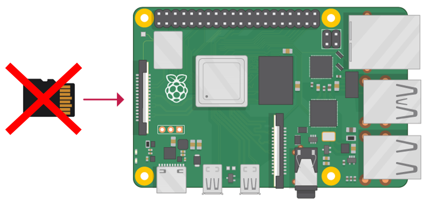
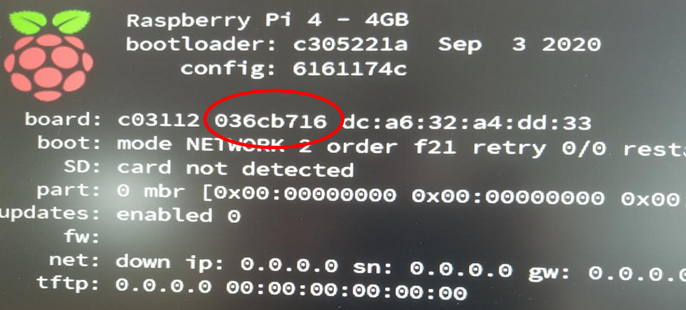

In this tutorial, we'll prepare a RPI able to boot **without SD card**.
The RPI will boot from an **ISO image located on a remote server**.




To boot the RPI from remote, we need to setup a server PC under Linux.
When booting, the RPI will ask on the network "is there a Netboot server here??", and our server will reply positively.
It will then serve the files from a `/boot` folder, mounted from an Raspbian ISO file.

First install the necessary packages:
```
apt update
apt install -y nfs-kernel-server dnsmasq kpartx unzip
```

Preparing the RPI
-----------------

We need to configure the RPI so it will search for a netboot server on the network.
If this fails, it will then try to boot from the SD card.
For this, you need to boot your RPI from an SD card with any Raspian OS (this is the last time we'll need an SD card :).
Launch `raspi-config` and select `boot-options`.
Select boot from network and then boot form SD card.

For configuring our netboot server, we need also need the RPI serial number:
```
$ cat /proc/cpuinfo | grep Serial | awk -F ': ' '{print $2}' | tail -c 8
036cb716
```
Alternatively, you can extract the number from the RPI boot screen:



Mouting the ISO image
---------------------

On the server, the first thing to do is to mount localy the ISO image so we can access the files inside it.
First, download and unzip an RPI ISO image.
Then use kpartx to map the partitions inside the ISO:

```
$ kpartx -av yourimage.img
add map loop11p1 (253:2): 0 524288 linear 7:11 8192
add map loop11p2 (253:3): 0 3080192 linear 7:11 532480

```
This command added two "device mappers", now located in /dev/mappers:
```
$ ls /dev/mapper/
loop11p1  loop11p2
```

We can use those devices to mount the partitions of the ISO:
```
$ cd /mnt
$ mkdir MyISO
$ mount /dev/mapper/loop11p2 MyISO
$ mount /dev/mapper/loop11p1 MyISO/boot
```

We have now mounted locally both the "root" partition and the "boot" partition of the ISO in the folder `/mnt/MyISO`.

Preparing the Netboot Server
----------------------------

For booting from the network, a netboot server is necessary.
Upon starting, the RPI will broadcast a DHCP request on the local network, asking for a netboot server.
The DHCP server should reply with the address of a TFTP ("Trivial File Transfer Protocol") server.
This TFTP server will then be able to deliver all the files that the RPI needs to boot up.

The Linux tool "dnsmask" can be used for both DHCP and TFTP.
Add the following lines in your file `/etc/dnsmask.conf`:

```
dhcp-range=172.16.11.255,proxy
log-dhcp
enable-tftp
tftp-root=/var/ftpd
pxe-service=0,"Raspberry Pi Boot"
```

172.16.11.255 is the IP of your network broadcast. Change it for your own network.
The DHCP server will reply to PXE requests on this network.
`proxy` means that the server will not interfere with other DHCP requests, rather relying on your network DHCP server.
This is useful if you install a PXE server on an existing network.

Now let's create the TFTP folder:
```
mkdir -p /var/ftpd
cd /var/ftpd
ln -s /mnt/MyISO/boot/ 036cb716
```

This create a link from the TFTP folder to the boot folder of the ISO.
The folder name `036cb716` corresponds to the RPI serial number.
It will be used by TFTP when replying to the RPI request, so you need to put your own RPI serial number.

At this point, the RPI should already be able of booting from the Netboot server.
You can try it: just switch on the RPI without SD card.
However, only the Kernel is available on the /boot folder, so the booting will stop after the kernel started.
We need to serve also the root folder, with the rest of the RPI OS.

Setting up the NFS server
-------------------------

The root folder will be served to the RPI using an NFS server.
First of all, we need to modify the file `/boot/cmdline.txt`, to direct the RPI to boot from the NFS server, instead of the SD card.

Update your file `/mnt/MyISO/boot/cmdline.txt` with:
```
console=serial0,115200 console=tty root=/dev/nfs nfsroot=172.16.11.191:/mnt/MyISO,vers=3 rw ip=dhcp rootwait elevator=deadline
```
This way, when finished booting, the kernel will mount the root folder from NFS. You need to put the IP of your boot server instead of `172.16.11.191`.

Let's activate the NFS server.
You just need to add those two lines in the file `/etc/exports`:
```
/mnt/MyISO *(rw,sync,no_subtree_check,no_root_squash)
/mnt/MyISO/boot *(rw,sync,no_subtree_check,no_root_squash)
```

Your RPI should now be able to mount the root folder from NFS.

That's it!
You can now switch on your RPI without SD card and see if it boots.


Additional notes
----------------

Docker doesn't work very well over NFS.
You need to change the stogare driver from `overlay` to `VFS`.
Add in this file `/etc/docker/daemon.json`:
```
{
  "storage-driver": "vfs"
}
```

This post is heavily inspired from this [article](https://williamlam.com/2020/07/two-methods-to-network-boot-raspberry-pi-4.html).


